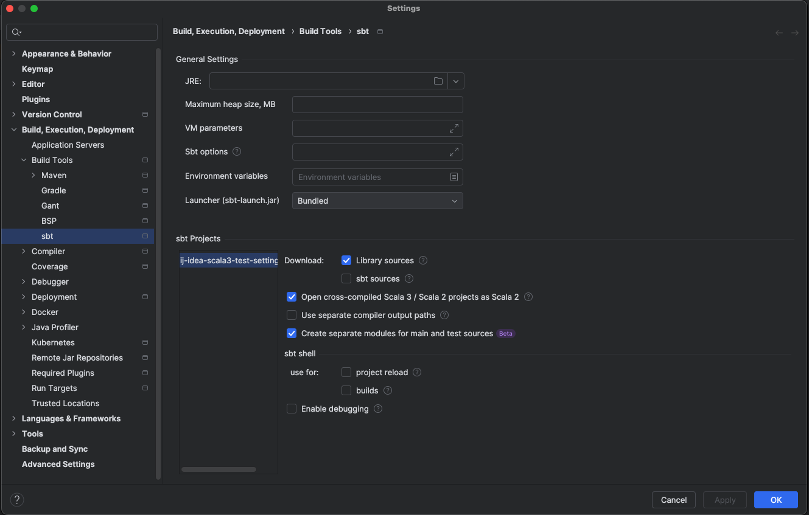

# ij-idea-scala3-test-settings-bug
reproduce bug in IJ Idea


## Version

```
IntelliJ IDEA 2024.3.1 (Ultimate Edition)
Build #IU-243.22562.145, built on December 8, 2024
Licensed to My Obfuscated Company

Runtime version: 21.0.5+8-b631.28 x86_64 (JCEF 122.1.9)
VM: OpenJDK 64-Bit Server VM by JetBrains s.r.o.
Toolkit: sun.lwawt.macosx.LWCToolkit
macOS 15.1.1
GC: G1 Young Generation, G1 Concurrent GC, G1 Old Generation
Memory: 2048M
Cores: 12
Metal Rendering is ON
Registry:
  ide.experimental.ui=true
  i18n.locale=
  scala.erase.compiler.process.jdk.once=false
Non-Bundled Plugins:
  org.intellij.scala (2024.3.22)
Kotlin: 243.22562.145-IJ
```

## Settings


## Problem running tests in IntelliJ 


## Project runs test fine in sbt shell
```
/Users/MYUSER/.sdkman/candidates/java/21.0.5-amzn/bin/java -server -Xmx1536M -Dsbt.supershell=false -Dgrouping.with.qualified.names.enabled=true -Dseparate.prod.test.sources.enabled=true -Didea.managed=true -Dfile.encoding=UTF-8 "-Didea.installation.dir=/Applications/IntelliJ IDEA.app/Contents" -Dsun.stdout.encoding=UTF-8 -Dsun.stderr.encoding=UTF-8 -jar "/Users/MYUSER/Library/Application Support/JetBrains/IntelliJIdea2024.3/plugins/Scala/launcher/sbt-launch.jar" early(addPluginSbtFile=\"\"\"/private/var/folders/yc/3gn32kzx763fqmbbkz0h4fkh0000gp/T/idea1.sbt\"\"\") idea-shell
[info] welcome to sbt 1.10.6 (Amazon.com Inc. Java 21.0.5)
[info] loading settings for project ij-idea-scala3-test-settings-bug-build from plugins.sbt, idea1.sbt...
[info] loading project definition from /Users/MYUSER/projects/BusyByte/ij-idea-scala3-test-settings-bug/project
[info] loading settings for project bug-root from build.sbt...
[info] set current project to bug-root (in build file:/Users/MYUSER/projects/BusyByte/ij-idea-scala3-test-settings-bug/)
[IJ]test
[info] compiling 1 Scala source to /Users/MYUSER/projects/BusyByte/ij-idea-scala3-test-settings-bug/modules/module-b/target/scala-3.3.4/classes ...
[info] FooTest:
[info] - testAddOne
[info] Run completed in 275 milliseconds.
[info] Total number of tests run: 1
[info] Suites: completed 1, aborted 0
[info] Tests: succeeded 1, failed 0, canceled 0, ignored 0, pending 0
[info] All tests passed.
[info] done compiling
[info] BarTest:
[info] - testReallyHappy
[info] Run completed in 81 milliseconds.
[info] Total number of tests run: 1
[info] Suites: completed 1, aborted 0
[info] Tests: succeeded 1, failed 0, canceled 0, ignored 0, pending 0
[info] All tests passed.
[success] Total time: 3 s, completed Dec 11, 2024, 10:33:50 AM
```